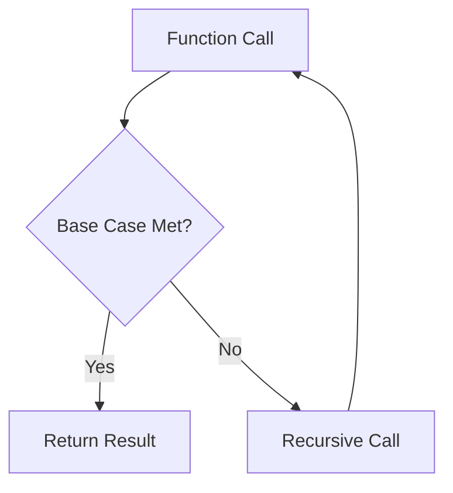
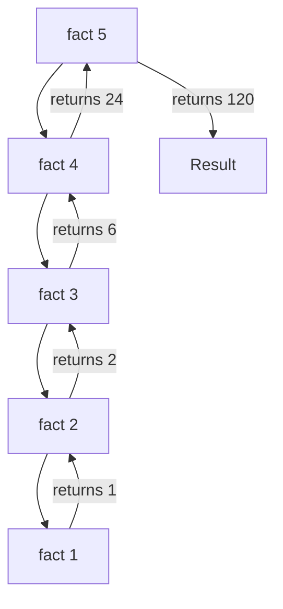
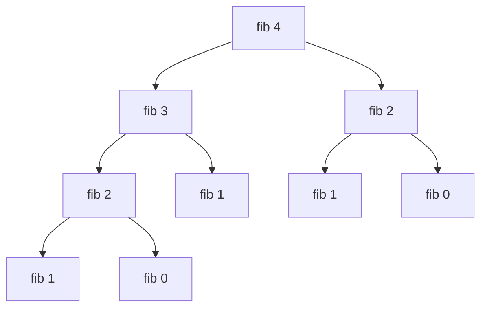
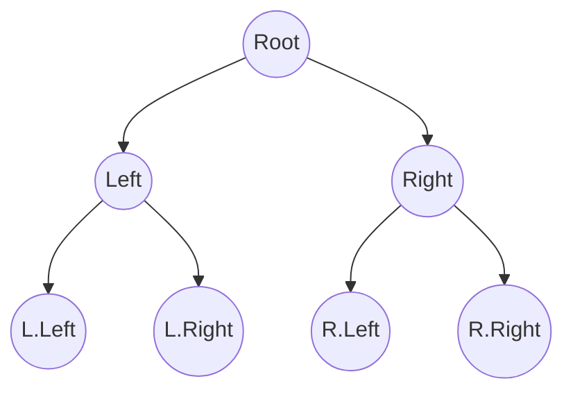

# Recursion in Algorithms

## Overview
Recursion is a programming technique where a function calls itself to solve a problem. It breaks down a complex problem into smaller, self-similar subproblems.

A recursive function typically consists of two main parts:
1.  **Base Case**: A condition that stops the recursion. It provides a direct answer for the simplest instance of the problem, preventing infinite loops.
2.  **Recursive Step**: The part where the function calls itself with a modified argument, moving the problem closer to the base case.

## Typical Problems Solved with Recursion

### Factorial Calculation
Computes the product of all positive integers up to `n`.
*   **Base Case**: `n = 0` or `n = 1` (return 1)
*   **Recursive Step**: `n * factorial(n - 1)`

### Fibonacci Sequence
Generates the `n`-th number in the Fibonacci sequence, where each number is the sum of the two preceding ones.
*   **Base Case**: `n = 0` (return 0) or `n = 1` (return 1)
*   **Recursive Step**: `fib(n - 1) + fib(n - 2)`

### Tree Traversal (DFS)
Visiting all nodes in a tree data structure (Pre-order, In-order, Post-order).
*   **Base Case**: Node is `null` (return)
*   **Recursive Step**: Visit node, then recursively visit left and right children.

### Tower of Hanoi
Moving a stack of disks from one rod to another, following specific rules.
*   **Base Case**: Move 1 disk directly.
*   **Recursive Step**: Move `n-1` disks to auxiliary rod, move largest disk to target, move `n-1` disks from auxiliary to target.

### Permutations of a String
Generating all possible arrangements of characters in a string.
*   **Base Case**: String is empty or length 1 (return string).
*   **Recursive Step**: Fix one character and recursively permute the rest.

### Flood Fill Algorithm
Used in graphics to determine the area connected to a given node in a multi-dimensional array (like the "bucket" tool in paint programs).
*   **Base Case**: Pixel is out of bounds or not the target color.
*   **Recursive Step**: Change color, then recurse on 4 neighboring pixels (up, down, left, right).
