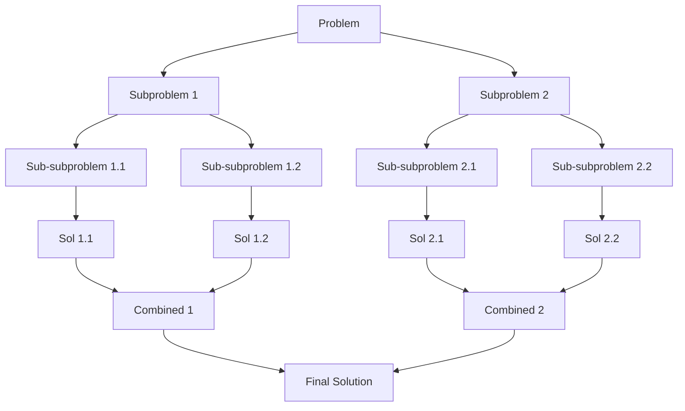
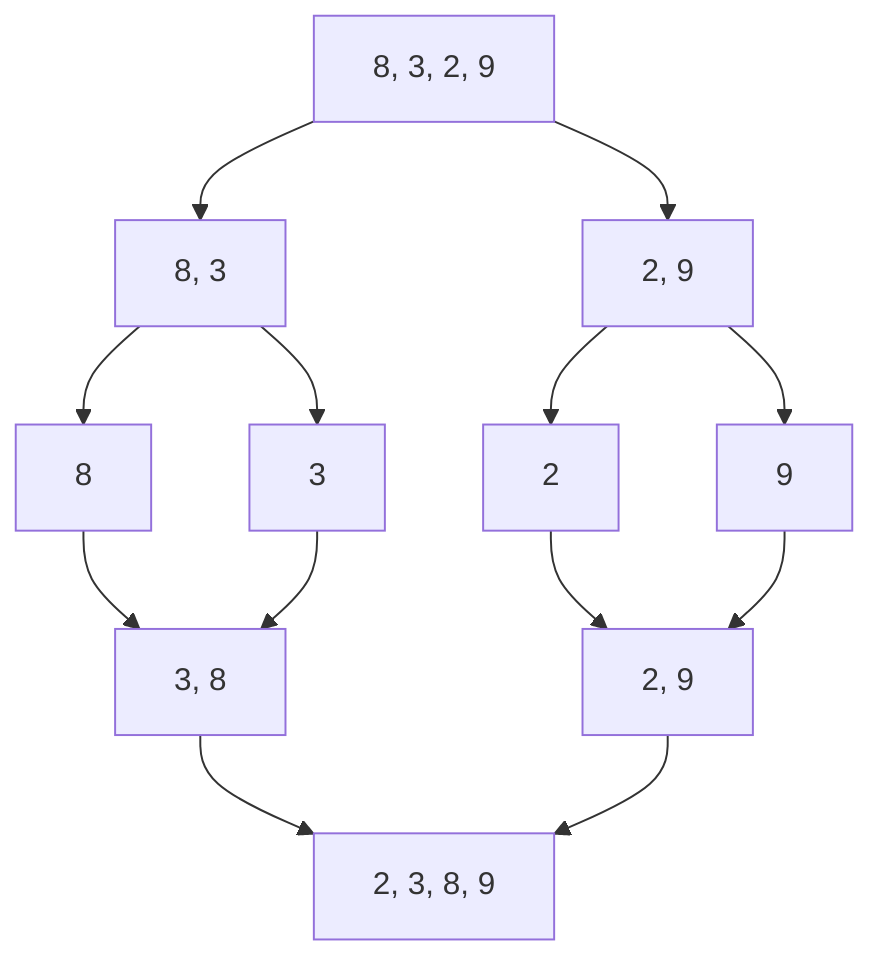
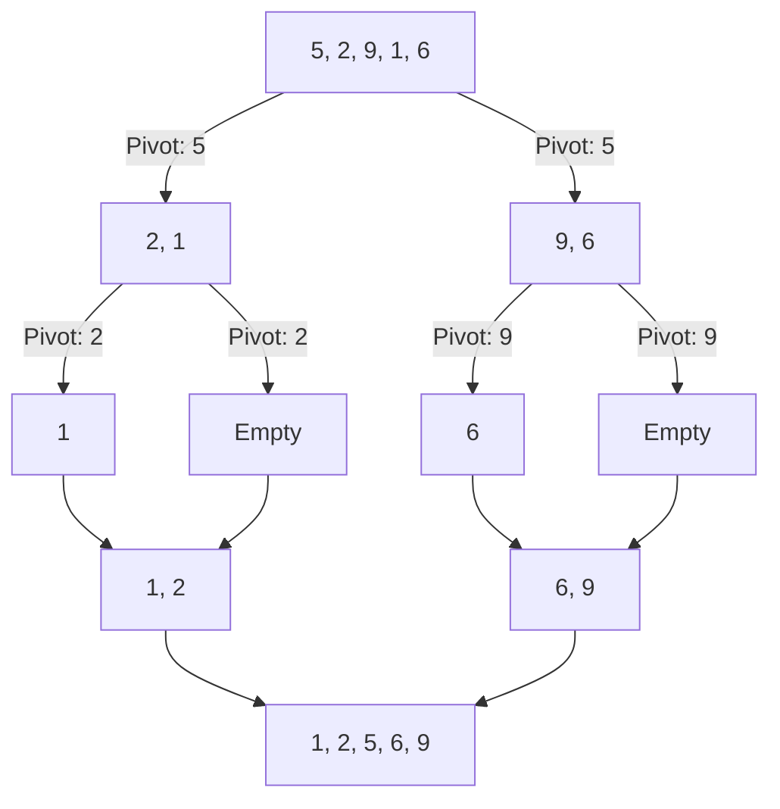
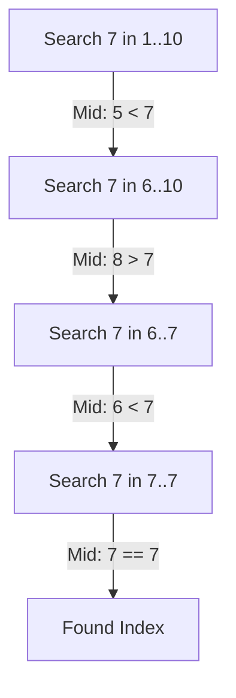
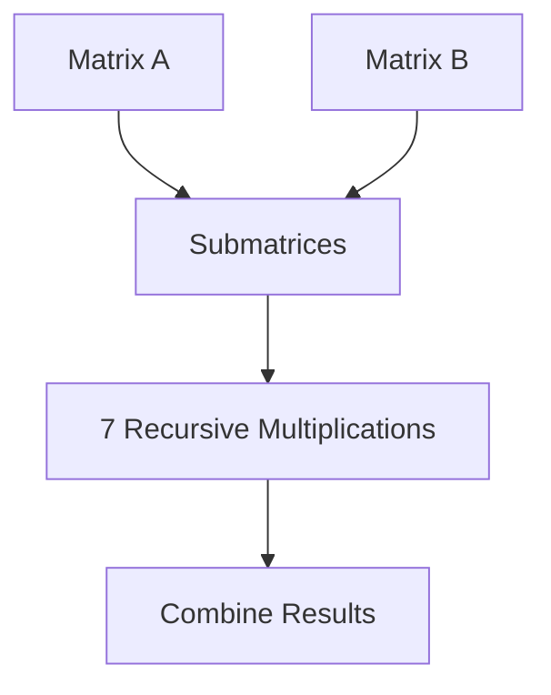
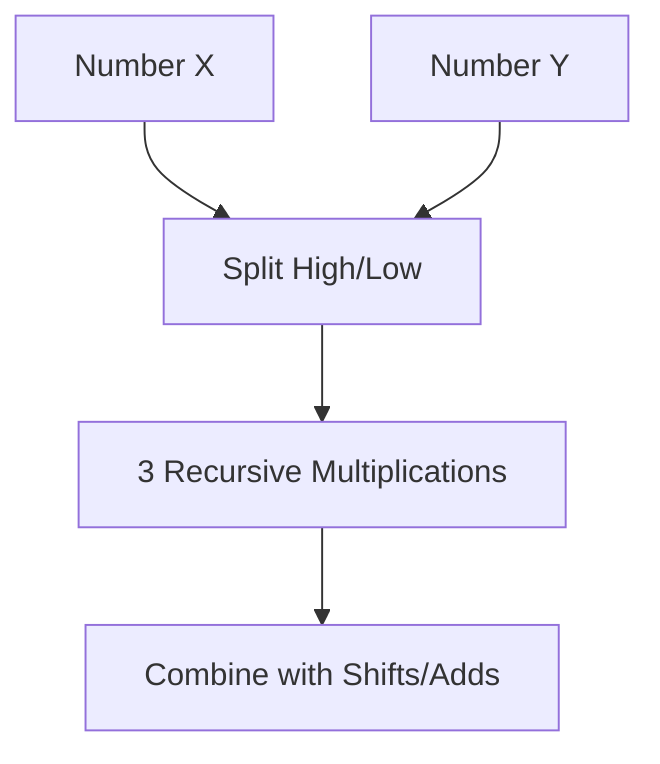
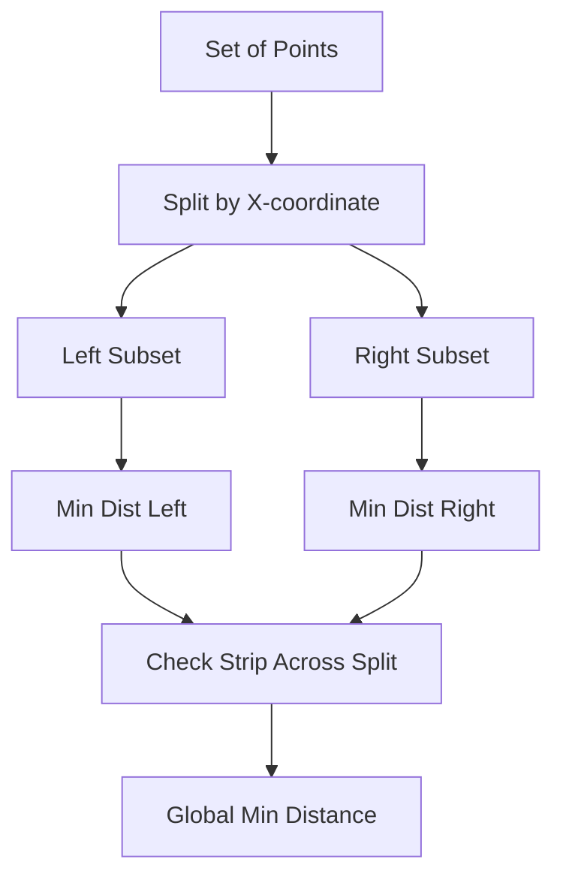
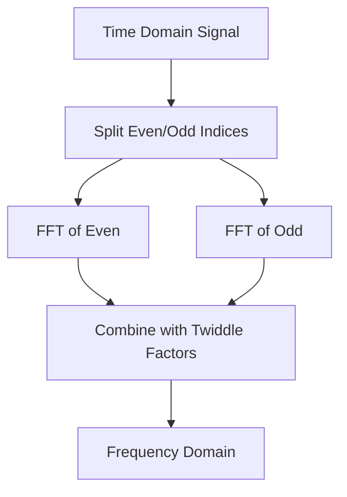
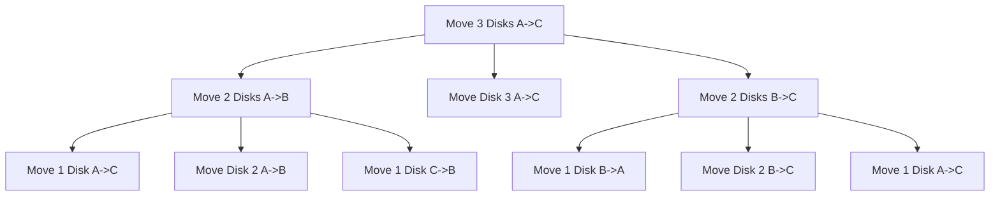

# Divide and Conquer

## Overview
Divide and Conquer is an algorithmic paradigm that solves a problem by breaking it down into smaller, more manageable subproblems, solving them recursively, and then combining their solutions to solve the original problem.

## The Three Steps
Given an input, a recursively executable function, and an output:

1.  **Divide**: Break the original problem into smaller, independent subproblems that are similar to the original but smaller in size.
2.  **Conquer**: Solve the subproblems recursively. If the subproblems are small enough (base case), solve them directly.
3.  **Combine**: Merge the solutions of the subproblems to create the solution for the original problem.

## Examples

### Merge Sort
Recursively divides the array into two halves, sorts them, and then merges the sorted halves.

### Quicksort
Picks a 'pivot' element and partitions the array into sub-arrays of elements smaller and larger than the pivot.

### Binary Search
Finds the position of a target value within a sorted array by repeatedly dividing the search interval in half.

### Strassen Matrix Multiplication
A faster algorithm for matrix multiplication that uses fewer scalar multiplications than the standard method.

### Karatsuba Algorithm
A fast multiplication algorithm for large numbers that reduces the complexity from O(n^2) to O(n^log3).

### Closest Pair of Points
Finds the pair of points with the smallest distance between them in a set of points in O(n log n) time.

### Fast Fourier Transform (FFT)
Computes the discrete Fourier transform (DFT) of a sequence, reducing complexity from O(n^2) to O(n log n).

### Tower of Hanoi
A mathematical puzzle where the objective is to move a stack of disks from one rod to another, following specific rules.
